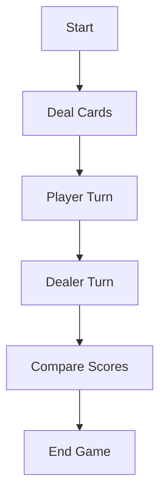

# 🃏 Blackjack Game — Capstone Project (Python)

## 📌 Project Overview
This project is a console-based Blackjack game written in Python. 
It simulates a real Blackjack game where the player competes against a computer dealer.

This README is written for absolute beginners.
No prior programming or Blackjack knowledge is required.

---

## 📂 Repository Structure
```
Blackjack-Game/
│── Black Jack Game _ Capstone Project 1.ipynb
│── README.md
```

---

## 🎯 Objective of the Game
The goal is to get a total card value closer to 21 than the dealer without exceeding 21.

---

## 🧮 Card Values
- Cards 2–10 → Face value
- J, Q, K → 10 points
- Ace → 11 or 1 (automatically adjusted)

---

## 🧠 Blackjack Rules
1. Both player and dealer get 2 cards
2. One dealer card is hidden
3. Player chooses Hit or Stand
4. If player exceeds 21 → Bust
5. Dealer draws until score ≥ 17
6. Scores are compared
7. Winner is announced
8. Option to play again

---

## 🔁 Game Flow Diagram


---

## 🧩 Code Explanation

### Importing Modules
```python
import random
```
Used to generate random cards.

---

### Dealing Cards
```python
def deal_card():
    return random.choice(cards)
```
Returns a random card from the deck.

---

### Calculating Score
Handles Blackjack and Ace adjustments.

---

### Comparing Scores
Determines win, loss, or draw.

---

## 🎮 Example Output
```
Your cards: [10, 9]
Dealer's first card: 7
```
---

## 🚀 Possible Improvements
- Betting system
- GUI
- Multiplayer

---

## 👨‍💻 Author
M Israr Ali
