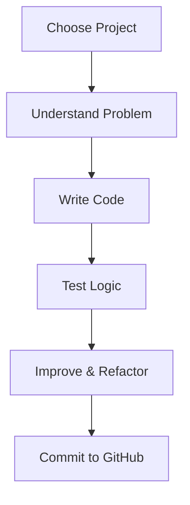
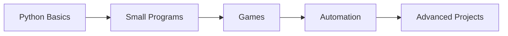

# 🐍 Python Projects Hub — Beginner to Advanced

## 🚀 Learn Python by Building Real-World Projects

Welcome to **Python Projects Hub**, a carefully curated repository containing **real-world Python projects** — from beginner-friendly games like **Blackjack** to logic-based utilities and automation scripts.

This repository is designed to help you:
- Learn Python **by doing**
- Understand programming concepts practically
- Build a strong **GitHub portfolio**
- Prepare for **interviews & real-world development**

---


---

## 📂 Repository Structure

```
Python-Projects/
│
├── Games/
│   ├── Blackjack/
│   ├── Guess-the-Number/
│   └── Tic-Tac-Toe/
│
├── Beginner_Projects/
│   ├── Calculator/
│   ├── Password-Generator/
│
├── Intermediate_Projects/
│   ├── File-Handling/
│   ├── APIs/
│
├── Advanced_Projects/
│   ├── Automation/
│   ├── Data-Processing/
│
├── README.md   ← You are here
```

---

## 🎯 Purpose of This Repository

The main goal of this repository is to:
- Teach **Python programming fundamentals**
- Apply logic through real projects
- Build confidence by completing projects
- Create a **job-ready portfolio**

---

## 🧠 What You Will Learn

✔ Python basics (variables, loops, conditions)  
✔ Functions & modular programming  
✔ Game logic & decision-making  
✔ File handling & data processing  
✔ Error handling  
✔ Clean coding practices  
✔ Problem-solving mindset  

---

## 🎮 Featured Projects

### 🃏 Blackjack Game (Console-Based)
A complete Python implementation of the Blackjack card game.
- Random card dealing
- Game rules enforcement
- Player vs Dealer logic
- Replay functionality

### 🔢 Guess the Number
Teaches randomness, loops, and conditionals.

### 🧮 Calculator
Beginner-friendly project to understand arithmetic operations and functions.

---

## 🖼️ Project Workflow Diagram



---

## 🧩 Coding Philosophy

This repository follows:
- Beginner-first explanations
- Clean and readable code
- Step-by-step logic
- Heavy comments inside code

---

## 📘 How to Use This Repository

1. Clone the repository
2. Navigate to any project folder
3. Read its README
4. Run the Python file
5. Experiment & improve

---

## 💡 Who Is This Repository For?

- Python beginners
- Computer science students
- Self-taught programmers
- Interview preparation
- Anyone learning programming

---

## 🧠 Learning Path Recommendation



---

## 🚀 Future Additions

- GUI-based Python apps
- AI mini-projects
- Web scraping tools
- Data analysis scripts

---

## 👨‍💻 Author

**M Israr Ali**  
Python | Machine Learning | Data Engineering  

---

## ⭐ Support This Repository

If you find this repository useful:
- ⭐ Star it
- 🍴 Fork it
- 📢 Share it

Happy Coding! 🐍✨
